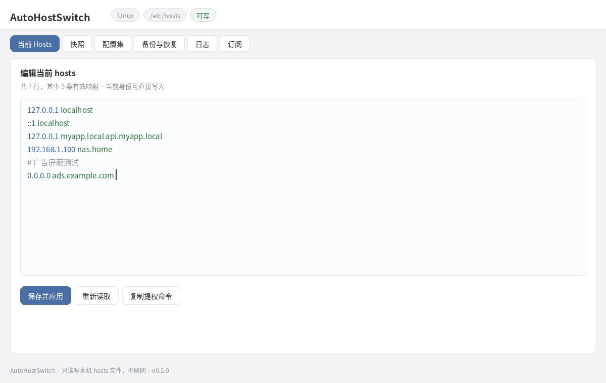
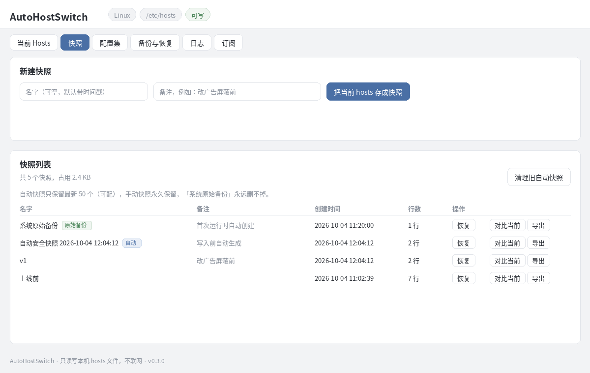
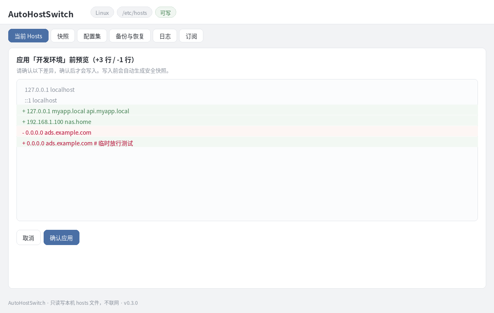
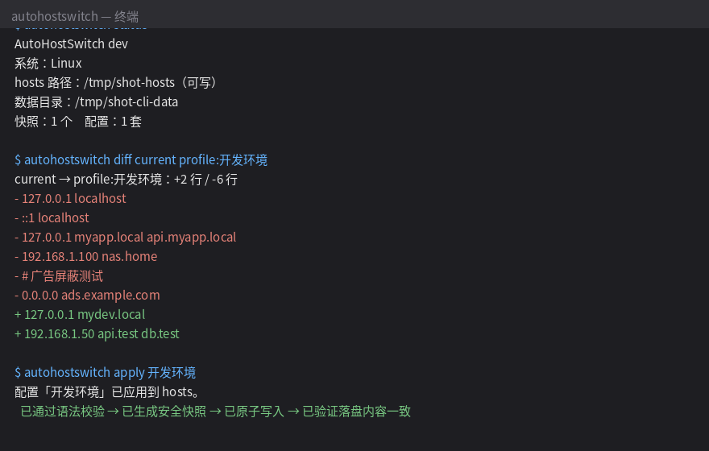

# AutoHostSwitch

**默认离线运行、单文件的跨平台 hosts 管理切换工具。**

手动改 hosts 的三大痛：改错一行全网瘫痪、找不到文件在哪、改前忘记备份。
AutoHostSwitch 一次解决：干净、轻量，一键快照、一键切换、一键还原。

```
┌─────────────────────────────────────────────┐
│  AutoHostSwitch                             │
│  1) 查看快照    3) 创建备份快照              │
│  2) 应用配置    4) 启动 Web 界面   5) 退出   │
└─────────────────────────────────────────────┘
```






## 为什么比别的 hosts 工具干净

| | AutoHostSwitch | 常见同类工具 |
|---|---|---|
| 网络行为 | **默认离线**（订阅需手动点，详见下） | 自动更新、遥测上报常见 |
| 体积/依赖 | 单文件，零第三方依赖，无运行时 | Electron 动辄上百 MB |
| 写入保护 | 校验 → 并发检查 → 自动安全快照 → **原子写入** → 落盘验证 | 直接覆盖，断电都可能写坏 |
| 后悔药 | 首次运行自动备份原始 hosts，随时一键还原 | 没有 |
| 改前预览 | Diff：应用前先看增删了哪些行 | 盲写 |
| 撤销 | 一键撤销上一次写入，可在改前/改后间来回切换 | 没有 |
| 并发保护 | 文件锁 + 哈希双保险，不覆盖别人的修改 | 直接覆盖 |
| 后台驻留 | 无，跑完即退 | 常驻托盘/服务 |

## 安装 / 升级 / 卸载

下载 [Releases](https://github.com/wangzi5151/autohostswitch/releases) 里对应系统的文件，
校验 `SHA256SUMS` 后即可用，不写注册表、不装服务：

```sh
# 安装（Linux 示例）
chmod +x autohostswitch-linux-amd64
sudo mv autohostswitch-linux-amd64 /usr/local/bin/autohostswitch

# 升级：下载新版直接覆盖同一个文件即可，配置/快照都在数据目录里，不受影响
# 卸载：删掉二进制 + 数据目录（见下表）即干净卸载，无残留
```

| 系统 | 数据目录（快照/配置/日志） |
|---|---|
| Windows | `%APPDATA%\AutoHostSwitch` |
| macOS | `~/Library/Application Support/AutoHostSwitch` |
| Linux / Termux | `~/.config/autohostswitch` |

## 一行启动

```sh
# Linux 64 位 / macOS / 树莓派（对应包名换一下）
chmod +x autohostswitch-linux-amd64 && sudo ./autohostswitch-linux-amd64

# Windows：右键 exe → 以管理员身份运行（见下）
# Termux：见 docs/TERMUX.md 专属教程
```

无参数运行进入**数字交互模式**，跟着序号选就行：

```
1) 查看快照      2) 应用配置      3) 创建备份快照
4) 启动 Web 界面  5) 退出
```

脚本/无人值守：

```sh
sudo autohostswitch snapshot "改前备份"     # 一键快照
sudo autohostswitch apply 开发环境 --dry-run  # 先预览 diff
sudo autohostswitch apply 开发环境          # 一键切换
sudo autohostswitch restore-original       # 一键还原（救命用）
autohostswitch serve                        # Web UI -> http://127.0.0.1:8080
```

退出码（给脚本用）：`0` 成功 / `1` 一般错误 / `2` 校验失败 / `3` 权限不足 / `4` 并发冲突。

## 核心功能

- **自动识别 hosts 路径**：Windows / Linux / macOS / Termux 各取真实路径，也支持 `--hosts` 手动指定
- **快照系统**：手动快照永久保留，自动快照只留最新 50 个（可调）；可重命名/删除/导出单个；**每次写入前自动生成安全快照**
- **配置集**：多套 hosts 方案一键应用，应用前语法校验 + diff 预览
- **原子写入**：临时文件 → fsync → 校验 → 原子替换 → 读回验证，崩溃断电不损坏原文件
- **并发保护**：读取时记哈希，写入前比对，被外部改过就中止（不覆盖别人的修改）；自家 CLI/Web 之间用跨平台文件锁互斥
- **撤销上一次**：CLI `undo` / Web “撤销上一次”按钮，改错了一键回去，还能再 Undo 回来（重做）
- **权限友好提示**：中文报错 + 可复制的提权命令，绝不自动强行提权
- **双模式**：完整 CLI + 内置 Web UI（单文件前端，语法高亮、实时校验、重复检测）
- **导出/导入**：整套快照+配置打成一个 JSON，换机同步，全程本地
- **紧急恢复**：首次运行自动备份的原始 hosts，一键还原
- **操作日志**：只记时间+动作，可一键清空，不收集设备信息

## 网络行为说明（“默认离线”是什么意思）

- 默认：**零网络请求**。不自动更新、不遥测、不上传 hosts、不连接任何第三方服务器。
- 唯一例外是「订阅」功能：只有你**手动点“拉取”**时才请求一次你填写的 URL，
  拉取后先预览 + 校验，必须二次确认才会写入。默认关闭，永不自动轮询。
- 自查方法见 [SECURITY.md](SECURITY.md)（三步审计指引）。

## 为什么我可以相信这个程序？

1. **只做 hosts 这一件事**：核心链路是 编辑 → 校验 → 配置集 → 快照 → Diff → 安全写入 → 恢复。
   与 DNS、Ping、代理、VPN 无关的功能不做。它能修改的**只有系统 hosts 这一个文件**（详见 SECURITY.md 的权限边界）。
2. **写操作不可能搞坏 hosts**：语法校验 → 并发哈希检查 → 进程间文件锁 → 自动安全快照 →
   原子写入（临时文件+fsync+rename）→ 读回验证。任何一步失败，原文件一个字节都不动；
   即使写入瞬间断电，也只会是完整旧文件或完整新文件。每次写入前自动快照 + 一键 Undo。
3. **恶意网页调不动它**：Web UI 只绑 127.0.0.1；Host 头校验防 DNS rebinding；
   写接口校验 Origin/Referer 防 CSRF；不设置 CORS 头；请求体限大小；严格 JSON（未知字段拒绝）；
   路径参数白名单（防穿越）；优雅关闭不留残留监听。
4. **二进制可验证来源**：每个 Release 附 SHA256SUMS + GitHub Artifact Attestation（Sigstore 签名）：
   `gh attestation verify autohostswitch-linux-amd64 --repo wangzi5151/autohostswitch`
5. **可审计**：零第三方依赖（`go.mod` 无外部模块），hosts 相关逻辑集中在 `core/`，
   重要位置均有中文注释；CI 每次跑 `gofmt`/`go vet`/全量测试/`govulncheck`/全平台编译。
6. **操作全程可追溯**：结构化操作历史（时间/来源 CLI·Web/操作/成功失败/关联快照），
   状态面板实时显示文件大小、行数、域名数，并能检测 hosts 是否被本工具之外的程序改过。

## Windows 管理员注意事项

修改 `C:\Windows\System32\drivers\etc\hosts` 必须管理员权限：

1. 右键 exe →「以管理员身份运行」；或
2. 管理员 PowerShell：`Start-Process .\autohostswitch-windows-amd64.exe -Verb RunAs`

权限不足时工具会明确告诉你，并给出可复制的命令。

## FAQ

**Q: 改错了怎么办？**
A: 提权后执行 `autohostswitch restore-original`，还原为首次运行时的原始 hosts。
每次写入前工具也会自动存一份安全快照，双保险。

**Q: 会偷偷联网吗？**
A: 不会。默认零网络请求，唯一的网络行为是你手动点的订阅拉取。见「网络行为说明」。

**Q: 快照会越积越多吗？**
A: 手动快照永久保留；自动快照只留最新 50 个（`AUTOHOSTSWITCH_AUTO_SNAP_MAX` 可调），
超出的自动清理，也可 `prune` 手动清理。快照列表显示磁盘占用。

**Q: 两个人/两个程序同时改 hosts 会怎样？**
A: 工具在读取时记录哈希，写入前比对；发现被外部改过就中止并提示，不会覆盖别人的修改。

**Q: 校验太严，我的写法被拒绝了？**
A: 真正无法使用的（坏 IP、缺域名、非法字符）会阻止；非标准但可能有效的
（如下划线、横杠开头结尾的域名）只会警告，不阻止。`validate` 命令可单独检查文件。

**Q: 支持 Windows 7 吗？**
A: 不支持。Go 1.21+ 工具链要求 Win10/Server 2016+。`windows-386` 包面向 32 位 Win10。

**Q: macOS 提示“无法验证开发者”？**
A: 系统设置 → 隐私与安全性 → 仍要打开。这是未签名二进制文件的常规提示。

**Q: 数据存在哪？卸载干不干净？**
A: 见上表「数据目录」。删掉二进制 + 数据目录即完全卸载，无注册表、无服务残留。

## 已知问题

- 部分杀软会拦截修改 hosts 的行为，属正常现象，加白即可。
- Android 未 root 时改不了 `/system/etc/hosts`，可用 `--hosts ~/hosts.test` 练手全部功能。
- Termux / macOS SIP / Windows 文件占用等平台细节，欢迎用真机测试后提 Issue。

## 开源协议

MIT，详见 [LICENSE](LICENSE)。更新日志见 [CHANGELOG.md](CHANGELOG.md)。
欢迎 PR（代码结构：`core` 核心逻辑 / `cli` 命令行 / `web` 内嵌 UI / `platform` 系统适配）。
